# **Cinerama Cinema**

Cinerama Cinema is a cinema for all film lovers. It offers all kinds of films - blockbusters, sing-alongs, concerts, old classics, documentaries - lets you pre-book snacks and has the cosiest salons that gives the visitors a 1950s Paris feeling. All to give the cinema goers the best experiance! The app is targeted at all adults that enjoy to watch not only blockbusters that are popular right now, but also films that are not commonly shown at cinemas because they are old or perhaps seen as being targeted at a small crowd. 

The app is a booking system for tickets and snacks so that almost everything is done when the user comes to the cinema. All the users have to do at the cinema is to pick up the snacks and pay, then they´re ready to go! The site acts as a repository for bookings as the users can store, update and cancel all their bookings through the app. They can also read about films that they might be interested in watching in the future. 

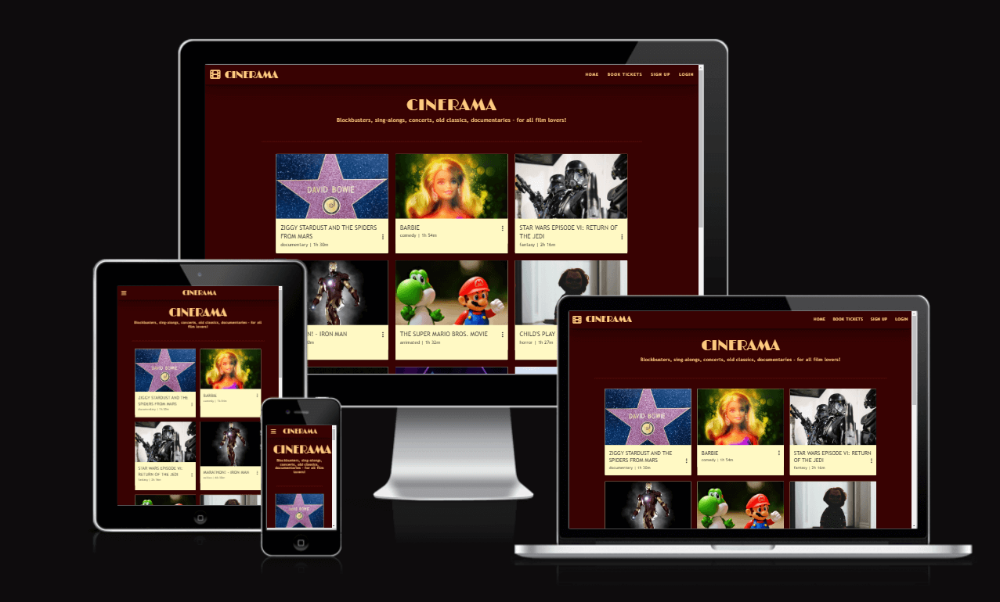

You can find the site [here](https://cinerama-cinema-4c2cf705bc92.herokuapp.com/).

## **UX**

### **User Stories**

The user of Cinerama Cinema would be any adult that enjoys watching films, that go to the cinema a lot and therefore needs the ticket and snack booking to be fast and easy. 

#### **EPIC - View Films**
Handles creation of the list of films available to watch at the cinema and the functionality to reveal a text description about each list item.
- As a Site User I can view a list of films so that I can read about them and figure out which one I want to watch.

#### **EPIC - Film Management**
Handles creation of a admin page to allow the admin to manage films shown at the site.
- As a Site Admin I can create, read, update and delete films so that I can manage my film program content.

#### **EPIC - User registration and Login**
Handles the creation of customer registration and login/logout functionality.
- As a Site User I can register an account so that I can book tickets to see a film and eat.
- As a registered Site User I can log in with my username and password so that the system can authenticate me.

#### **EPIC - Booking**
Handles creation of the booking page at the site, containing form that needs to be filled in to book tickets. It also handles creation of user profile page where the user can see it´s bookings.
- As a Site User I can can choose a film to watch, depending on date, by adding a number of tickets so that I can watch a film when I´m free according to my calendar.
- As a Site User I can view the snacks meny and choose snacks so that I can eat and drink during a film.
- As a Site User I can book tickets so that I can watch the film.
- As a Site User I can view all my bookings so that I can keep track of them.
- As a Site User I can edit or cancel a tickets and snacks booking on my profile page so that I can manage my bookings.

### **Design**

The site was built with the goal to give it a feeling of a cinema in Paris in the 1940-1950s, giving the visitors of the site a little hint that this cinema not only offers new blockbuster films. Colors were chosen to make it feel like going into an old salon with dim lighting, large red drapes and golden details. The colors were also chosen with contrast ratio in mind, to make the site as accessible as possible.

The main fonts used are Limelight and Poiret-One. They are imported with [Google Fonts](https://fonts.google.com/). They were chosen because they look like fonts used by cinemas in Paris in the 1940-1950s.

#### **Wireframes**

<details>

<summary>Home page</summary>

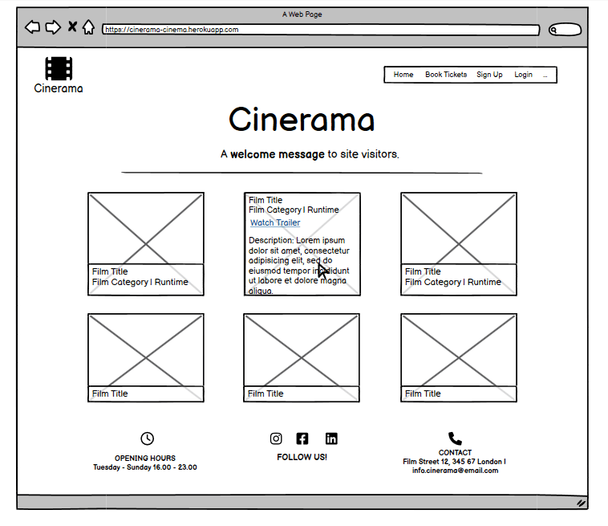
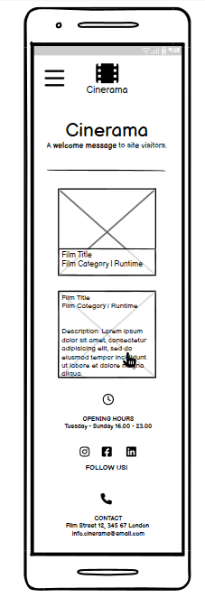
</details>

<details>

<summary>Sign Up</summary>

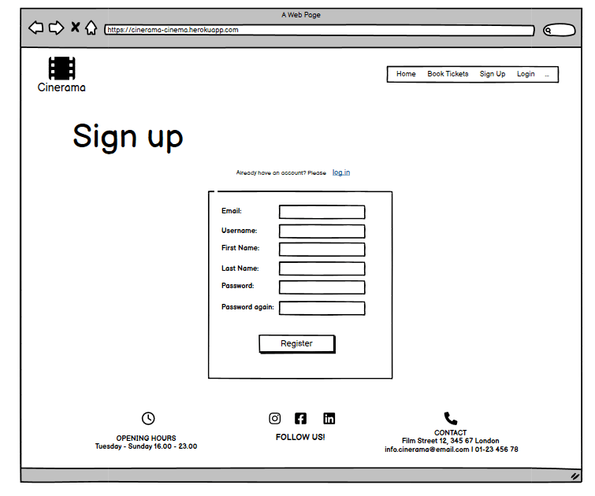
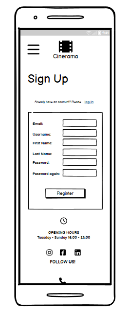
</details>

<details>

<summary>Log In</summary>

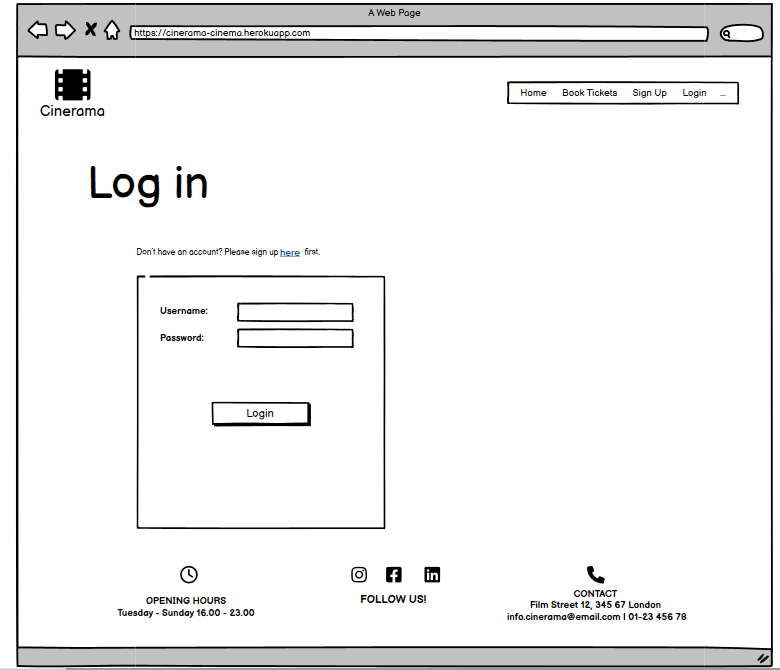
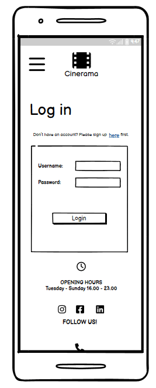
</details>

<details>

<summary>Log Out</summary>

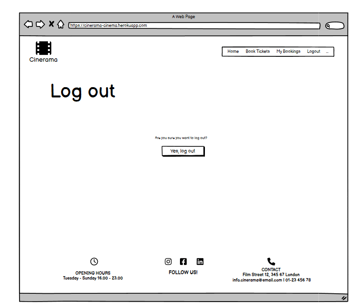
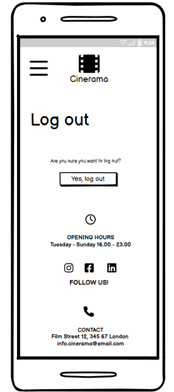
</details>

<details>

<summary>Book Tickets</summary>

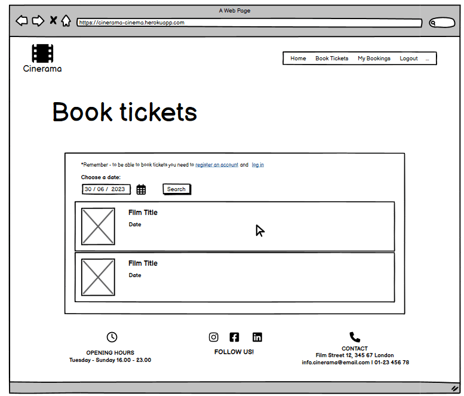
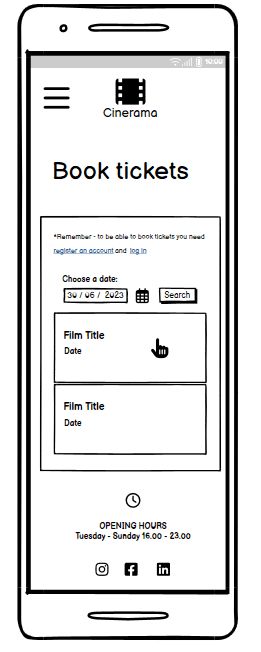
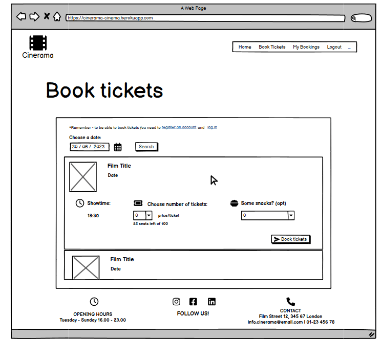
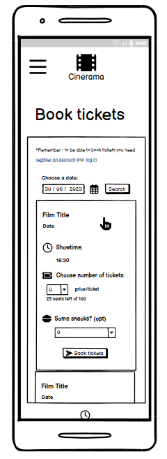
</details>

<details>

<summary>My Bookings</summary>

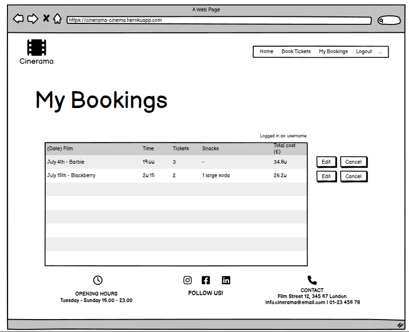
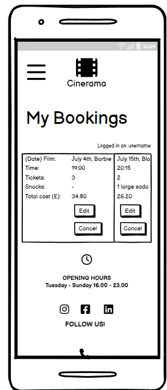
</details>

<details>

<summary>Edit</summary>

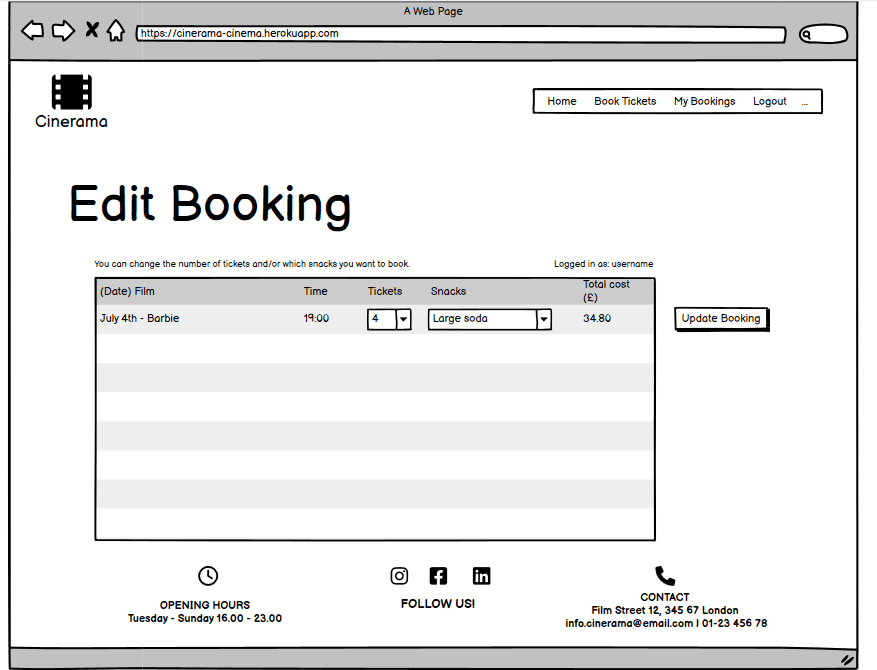
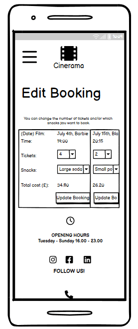
</details>

<details>

<summary>Cancel</summary>

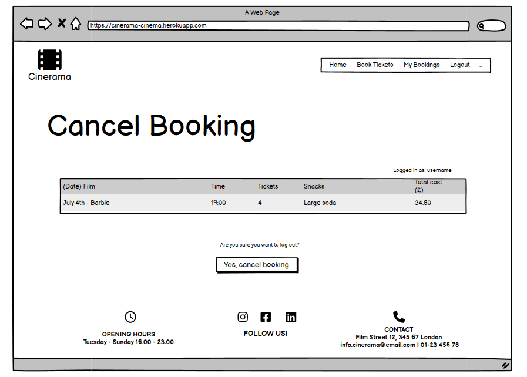
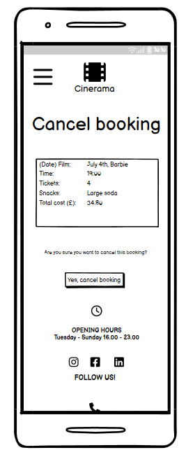
</details>

## **Agile Development**

The app was built using an agile approach, with a GitHub project board, milestones, labels and issues. The GitHub project board can be found [here](https://github.com/users/sarasm93/projects/4). All epics and user stories mentioned above were created with GitHub issues. The agile development iterations are created with milestones. All issues are linked to a milstone. They are also linked to an epic using labels. Labels have also been used to priorities which issues are most important by create labels namned "must have", "should have", "could have" and "wont´t have". 

## **Data models and database**

The below ERD diagram was made using [Lucid Charts](https://www.lucidchart.com/pages/landing?utm_source=google&utm_medium=cpc&utm_campaign=_chart_en_tier2_mixed_search_brand_exact_&km_CPC_CampaignId=1520850463&km_CPC_AdGroupID=57697288545&km_CPC_Keyword=lucid%20charts&km_CPC_MatchType=e&km_CPC_ExtensionID=&km_CPC_Network=g&km_CPC_AdPosition=&km_CPC_Creative=442433237648&km_CPC_TargetID=kwd-64262996435&km_CPC_Country=9062397&km_CPC_Device=c&km_CPC_placement=&km_CPC_target=&gclid=CjwKCAjwwb6lBhBJEiwAbuVUSp5GJupY-n0T0KIxQyga5tojqyWYZIbI3dXIpvdCgxbxCcPYgxb-_RoCMJAQAvD_BwE) and shows the structure of the PostgreSQL database used in this project. The diagram visualises the types of data models required for the project and the relationships between them. 

Django AllAuth was used for the user model and user authentication system.

The booking model was created so the user can create bookings that can be edited and cancelled. 

The film showtime model holds the film program with information about when each film is shown and the price for it. 

The snack model contains the different snacks that can be booked and what they cost.

The Film model holds all information about a film, such as title, description/plot, director, runtime and so on, so that the user can read about a film. 

The genre model was created so that each film can have a genre added to it. This gives the users a quick perception of which films might be interesting to them.

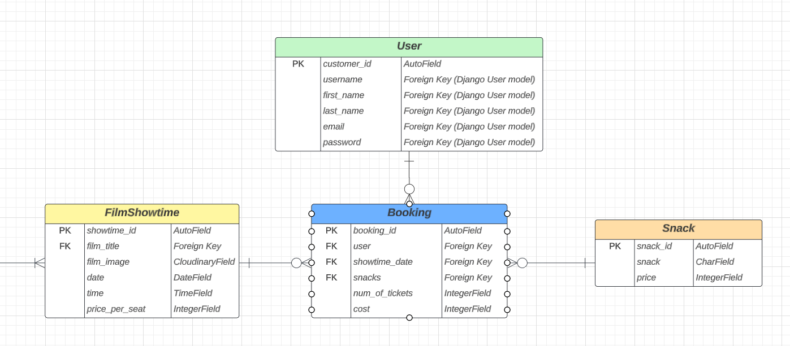
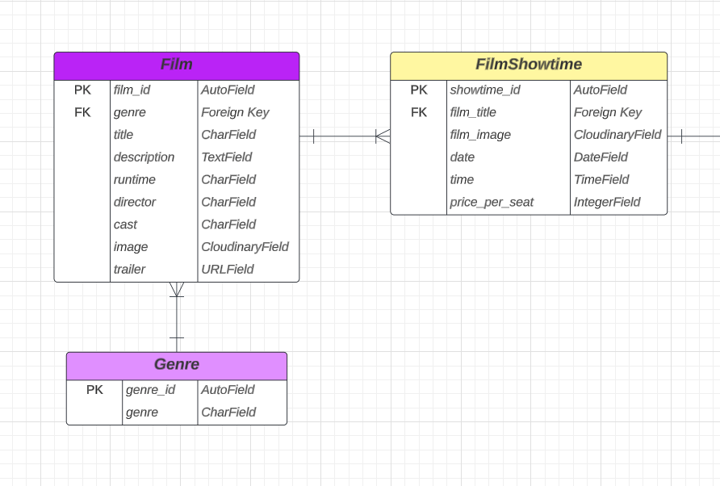

## **Features**

### **Existing features**


### **Future features**

- User cannot change or cancel booking within 2 days of the film. 
- Users can order several popcorn buckets/sodas of one sizes (rather than only one) per booking. 

The above features are listed in a GitHub Project used as backlog for the app. The backlog is found [here](https://github.com/users/sarasm93/projects/6).

## **Testing**

TABEEEEEEEEEEELL???????????

The accessibility of the site has been checked with Lighthouse in DevTools. The results for the final site is shown below.


The first Lighthouse test showed an overall good performance for the site. The testing showed a slightly lower score, 87-89% accessability, for the booking page (booking.html) and edit booking page (edit.html) due to missing labels on form fields and use of `<h6>` elements in the footer. To solve this a changed all `<h6>` elements to `<p>` elements. A label was added in filters.py to the filter date form, replacing a `<p>` element and icon that was there before. Then I did some restyling in style.css to make the form look good again. For the edit booking form I added labels in forms.py using a widget and then hidd the labels with `visibility: hidden` and `font-size: 0;` in style.css in order for the booking data to still fit into the table nicely. This made the accessability score increase to 91% and 98%. - KKKKKKAAAAAAAAAAAANNNNNNNNNSSSSSSKKKKEEE ÄNDRA NÅGOT, BEROENDE PÅ VAD SISTA TESTERNA VISAR!

### **Validator testing**

I have validated my HTML, CSS, Javascript and Python code with the below websites.

- HTML: [W3C Markup Validation Service](https://validator.w3.org/#validate_by_input)
- CSS: [W3C CSS Validation Service](https://jigsaw.w3.org/css-validator/#validate_by_input)
- Javascript: [JSHint](https://jshint.com/)
- Python: [CI Python Linter](https://pep8ci.herokuapp.com/)

Validation of the HTML, CSS and Javascript code didn´t return any errors or warnings except for some trailing whitespaces or lines of code that were too long. These warnings/errors were solved by removing the whitespaces and dividing the too long code lines into multiple lines with proper indentation.

Validation of the python code returned some warnings and errors. They are presented below together with actions taken to solve them.

#### **Home page**
**Error:** In the films.html `id=trailer` was added to the anchor element for the trailer link on the film card. This was of course noticed by the validator raising an error saying that the page contained duplicate IDs when several film cards are displayed on the page.<br>
**Solution:** The `id` was changed to a `class`, which is the correct way to style an element if more than one is being styled.
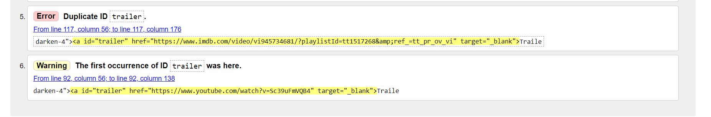

**Error:** Missing `alt` attribute on the image element in the films.html.<br> 
**Solution:** adding an `alt` attribute to the image element.
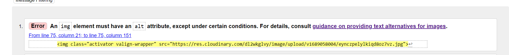

**Error:** Not allowed to have a `<p>` element inside `<span>`. The reason behind this error was because of a truncate-class (Materialize class) that I had added to the film title `<p>` on the card in films.html (see 'Before' below). The `<span>` made it possible to truncate the film title without making the overflowing title text hide the genre and runtime text under the title. Without the `<span>` the genre and runtime was overflown with empty overflow (see image below).<br> 
**Solution:** The `<span>` containing the `<p>` with the film title was changed to a `<p>` element (to keep all the styling classes). Then the original `<p>` with truncate class was removed. This prevent the film title to push the genre and runtime outside of the card when the film title dosen´t fit on one line, the line-height and margin for the film card content and title was adjusted, the card height was increased and the styling of the text for the film title and genre was changed so that it got more space on the card at the same time as the image got a little less space. 

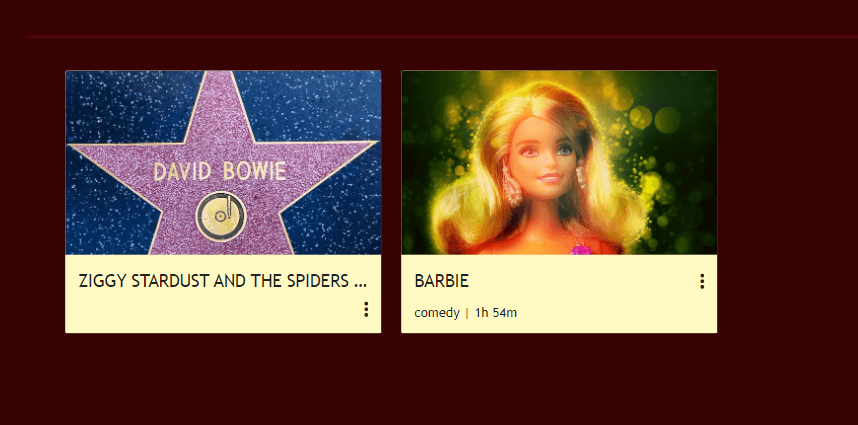

Before:
```
<span class="card-title activator grey-text text-darken-4">
                       	<p class="truncate">{{ film.title }}</p><i class="fa-solid fa-ellipsis-vertical right"></i>
                   	</span>
                   	<span class="card-subtitle activator grey-text text-darken-4">{{ film.genre }} |
                       	{{ film.runtime }}</span>
```

After:
```
<p class="card-title activator grey-text text-darken-4 clip-text">
                    {{ film.title }}<i class="fa-solid fa-ellipsis-vertical right"></i>
                </p>
                <p class="card-subtitle activator grey-text text-darken-4">{{ film.genre }} |
                    {{ film.runtime }}</p>
```

#### **Book tickets page**
**Error:** Missing `alt` attribute on the image element and a missing closing `<div>` tag, in booking.html.<br>
**Solution:** adding an `alt` attribute to the image element and the missing closing `<div>` tag at the correct place in the code.

**Error:** Stray start and end tags for table elements `<tr>`, `<th>` and `<td>` on the booking page (booking.html). The table content is created when the date form to filter films by date on the booking page is used.<br>
**Solution:** The form template variable `{{ myfilter.form }}` is put within `<table>` tags.

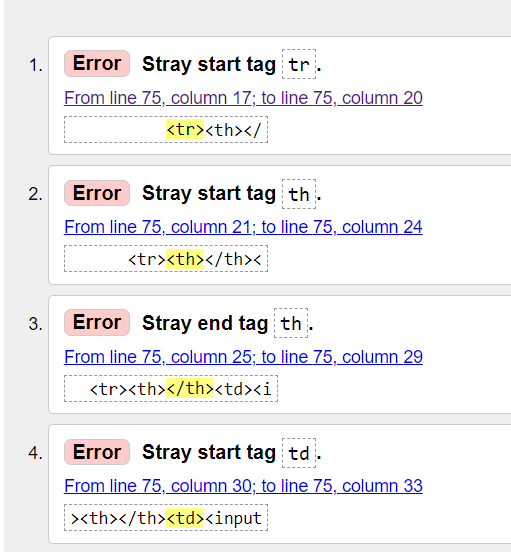

**Error:** Double IDs for number of tickets, snacks and price per seat form fields on booking page.<br> 
**Solution:** For the price per seat field, the error was caused by a manually added `id`. The `id` just changed to a `class` in order to solve the error. The ids for number of tickets and snacks fields were auto generated by Django. To remove them `auto_id=False` was added to the context BookingForm in the `view_showtimes`-function in views.py, used to render the film showtimes.   
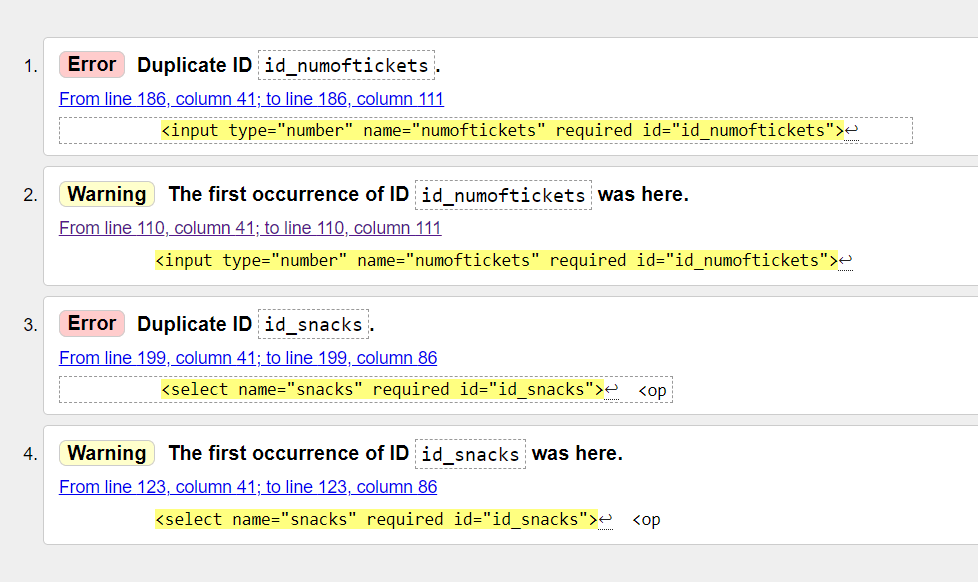

#### **My Bookings page**
**Error:** Button element nnot allowed in anchor element in my-bookings.html, caused by "Edit" and "Cancel" buttons in the table for all the users bookings.<br>
**Solution:** This was solevd by replacing the anchor elements with forms with action attributes. 
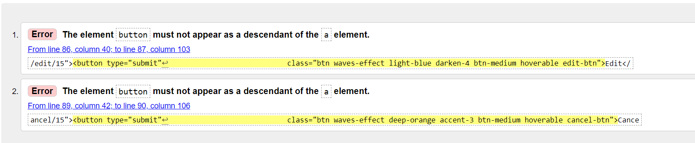

#### **Edit page**
**Error:** An error saying that the column with for `<td>` in the edit.html file is not matching the width for the `<th>`. This is caused by the fact that one extra `<th>` element had been added to the edit table to make the "Update" button fit nicely into the table, with som extra space around it. <br>
**Solution:** As the space around the button can be added with styling instead, the extra `<th>` element was removed to solve the error. 


### **Resolved problems and bugs**

The favicon wouldn´t show up when trying to add it in the early stages of the app. This was due to it being added to the root directory. To solve the bug the icon was moved to the static folder adn then it rendered correctly. 

Early on in the development of the app, all footer icons had custom Materialize color classes. I tried to add a hover effect to change the color of the "follow us"-icons anchor tags, but it didn´t work. To solve this I removed the Materialize color class and added standard css color styling on the anchor tags instead. Then the hover effect worked. For better user experiance, this needed to be solved since there are many other icons on the page that are not clickable. The once that are clickable should be highlighted. 

Early on the plan was also to place the brand logo in the top left corner of the navbar on mobile and tablet devices. But when working with Materialize I realised that the default placement of the 'brand-logo'-class was in the middle. To not go against the framework I removed the Materialize navbar I first selected and replaced it with one that better handles collapsing of the navbar list items on small devices. 

When making a booking, booking snacks should not be required. Therefore `blank=True` was added to the Booking model snack field. But, if this is done a bug is created when the total price for the booking is calculated caused by the fact the `blank=True` means that `None` is returned. When trying to calculate the price the below error was thrown. To solve this I removed `blank=True` from the model field and added a new alternative to the snack menu (a new post in the model) called "None" with a price of 0. I also made the "None" alternative the initial value, prefilled in the booking form when it renders, so that the form wasn´t adding any unexpected items and costs to the booking.


On the My Bookings page, the color of the table headers disappear on smaller devices when there are no bookings in the table, see image below (as soon as bookings are added the color shows). To solve this, background-color is added with a Materialize color class on the `<thead>` in the my-bookings.html file, like this: `<thead class="yellow lighten-3">`. 

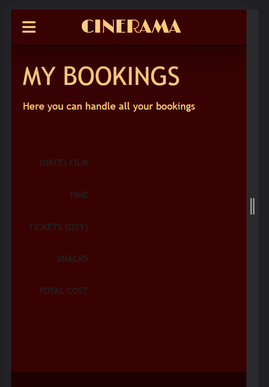

Another bug that showed up was for the sign up form. If a user tries to sign up with for example a username and email that is already registered with another user, error messages are shown in the sign up form. If there ere many error messages, the submit button was pushed of the white sign up container/card, see image below. To solve this I put the button on a separate row in the sign up form container (it was previously on the same row as the form). 

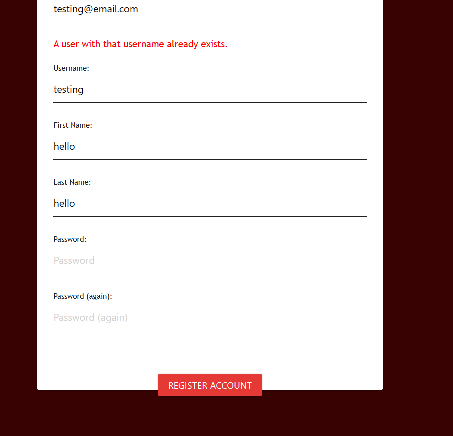 

## **Deployment**

The site was deployed to Heroku from GitHub with the following steps:

1. Create an external database using [ElephantSQL](elephantsql.com). When logged in to your ElephantSQL account, click on “Create New Instance”, choose a plan and give it a name. Then select a region, click the "Review" button to view the details for your plan and finally click "Create instance". 

2. Create a Heroku app by logging in to your Heroku account. Click the "New" button in the top right corner and then "Create new app". Give it a name, choose a region and then click the "Create app" button. 

3. Attach the external database. 
	- In the Heroku app that you created, you need to create environment variables, called Config Var in Heroku. This is done under the "Settings"-tab in the top menu. Click the tab. On the settings page scroll down to the Config Vars-section and click the "Reveal Config Vars"-button. 
	- Go back to your ElephantSQL account, and from the dashboard click on the database instance name for the project. When in the project instance, copy the ElephantSQL database url by clicking on the copy icon. In the Config Vars section in at Heroku, add this url to the VALUE field and add DATABASE_URL to the KEY field. 
	- In your workspace, create a file called env.py in the top level directory. Add env.py to the list of files in .gitignore. In the env.py file, import the os library and add the ElephantSQL DATABASE_URL and a chosen SECRET_KEY value. Also, at Heroku, add you secret key as a config var. Add SECRET_KEY in the KEY field and the secret key in the VALUE field. 

4. Prepare the settings.py file and the environment starting by adding:	

```
import os
import dj_database_url

if os.path.isfile("env.py"):
    import env
```
Then remove the default secret key and replace it with SECRET_KEY. Comment out or remove the default database configuration and add this instead:

```
DATABASES = {
    'default':
        dj_database_url.parse(os.environ.get("DATABASE_URL"))
}
```
Save all files and make migrations. 

5. Set up Cloudinary by (when logged in to your account on Cloudinary) copying your url on the Cloudinary dashboard and paste it into the env.py file, like you did with the SECRET_KEY and DATABASE_URL. Then go to Heroku and the url to the config vars. Add CLOUDINARY_URL in the KEY field and your url in the VALUE field. If you deploy your app early on in the project process, also add DISABLE_COLLECTSTATIC in KEY field and 1 to VALUE field (remove it before final deployment). Add Cloudinary Libraries to the list of installed apps in settings.py. Then also add static files settings in settings.py to tell Django to use Cloudinary. Type:

```
STATIC_URL = '/static/'

STATICFILES_STORAGE = 'cloudinary_storage.storage.StaticHashedCloudinaryStorage'
STATICFILES_DIRS = [os.path.join(BASE_DIR, 'static'), ]
STATIC_ROOT = os.path.join(BASE_DIR, 'staticfiles')

MEDIA_URL = '/media/'
DEFAULT_FILE_STORAGE = 'cloudinary_storage.storage.MediaCloudinaryStorage'
```
The link the file to the templates directory in Heroku by typing `TEMPLATES_DIR = os.path.join(BASE_DIR, 'templates')` and then change the templates directory to TEMPLATES_DIR, so that it looks like this `'DIRS': [TEMPLATES_DIR]`. Finally add your Heroku hostname to allowed hosts, together with you local host. 

6. Create files and directories. Add a requirements.txt file. Create 3 folders called media, static and templates on top level directory. Also create a file on the top level directory called Procfile and add this code `web: gunicorn your-project-name.wsgi`.

7. Before your final deployment you need to set `Debug=False` in the settings.py file. Then save all files, add, commit and push your code to GitHub. Then go to Heroku. Scroll to the top menu and click the "Deploy"-tab. Scroll to the "Deployment method"-sction and select GitHub. In the "Connect to Github"-section that shows up, click on "Connect to GitHub". When the connecting is done you will see a search bar where you can search for the repository name. Click on the "Connect"-button that shows up when Heroku has found your repository. Scroll further down and choose either to deploy automatically by clicking the "Enable Automatic Deploys" or deploy manually by clicking the "Deploy Branch"-button. When the deployment is finished you can go to the "Settings"-tab again and scroll down to the "Domains"-section where you can find the link to your deployed app.

## **Technologies, Languages, Frameworks, Libraries, Servers, Programs and Sites used**

### **Languages**
- HTML
- CSS
- Javascript
- Python

### **Frameworks**
- [Django](https://www.djangoproject.com/) - main Python web framework used to develop this project
- [Materialize](https://materializecss.com) - to make the site responsive and to style user interface templates with the card reveal component, navbar (and sidnavbar for mobile devices), footer, toast messages, dropdown lists in forms, table for user bookings and collapsible view of the booking form for tickets. 

### **Libraries**
- [Psycopg2](https://pypi.org/project/psycopg2/) - Python-PostgreSQL database adapter, in order to use Python code (instead of SQL) to do Postgres commands 
- [urllib3](https://pypi.org/project/urllib3/1.26.15/) - user-friendly HTTP client for Python used by many components in Python, such as requests and pip

### **Servers**
- [Gunicorn](https://gunicorn.org/) - Python WSGI HTTP Server acting as the web server for the project
- [PostgreSQL]()

### **Programs and Sites**
- [GitHub](https://github.com/)- version control and as agile tool
- [Lucidchart](https://www.lucidchart.com/pages/landing?utm_source=google&utm_medium=cpc&utm_campaign=_chart_en_tier2_mixed_search_brand_exact_&km_CPC_CampaignId=1520850463&km_CPC_AdGroupID=57697288545&km_CPC_Keyword=lucidchart&km_CPC_MatchType=e&km_CPC_ExtensionID=&km_CPC_Network=g&km_CPC_AdPosition=&km_CPC_Creative=442433237648&km_CPC_TargetID=kwd-33511936169&km_CPC_Country=9062397&km_CPC_Device=c&km_CPC_placement=&km_CPC_target=&gclid=Cj0KCQjwnMWkBhDLARIsAHBOftrLqk9mpk7BpbSpfCB82TCw4CoQ4k4-1IqLKE5G5i3Cs5Q-3_ysvx4aAtpTEALw_wcB) - create database model schema
- [Balsamiq](https://balsamiq.com/) - create wireframes 
- [Cloudinary](https://cloudinary.com/) - image hosting and management 
- [ElephantSQL](https://www.elephantsql.com/) - free database service that hosts the PostgreSQL database for this project

## **Credits**

Materialize was used to make the site responsive and to style user interface templates:
- [card reveal component](https://materializecss.com/cards.html) on the films available at the cinema to reveal text about them.
- [navbar](https://materializecss.com/navbar.html) and [sidnavbar for mobile devices](https://materializecss.com/sidenav.html) to make it responsive and look good on all devices
- [footer](https://materializecss.com/footer.html) to make it responsive and look good on all devices 
- [toast messages](https://materializecss.com/toasts.html) to display alert messages when the user interacts with the site
- [dropdown lists in forms](https://materializecss.com/select.html) to make the forms easy to use and nice to look at
- [responsive table](https://materializecss.com/table.html) for user bookings to be displayed in a structured, and responsive, way
- [collapsible view](https://materializecss.com/collapsible.html) to display the film showtimes and booking form for tickets in a strucutred way giving the user a clear overview. 

To filter films on the "Book tickets" page based on their showtime date, code from [Codechit.com](https://www.codechit.com/django-filter-search-form-guide/), [Letscodemore.com](https://www.letscodemore.com/blog/customizing-django-filters-with-css-classes/), [this forum-djangoproject-com page](https://forum.djangoproject.com/t/initialize-a-django-filter-with-date/11565) and [this forum-djangoproject-com page](https://forum-djangoproject-com.translate.goog/t/initialize-a-django-filter-with-date/11565?_x_tr_sl=en&_x_tr_tl=sv&_x_tr_hl=sv&_x_tr_pto=sc&_x_tr_hist=true) was used to create the working code in the project.

Code on lines 309-321 in style.css was taken from [this Stackoverflow site](https://stackoverflow.com/questions/34248898/how-to-validate-select-option-for-a-materialize-dropdown). It helps to show the error message for invalid input for "Choose number of tickets" field in booking form.

All Javascript code in the script.js file is taken from [Materializecss.com](materializecss.com) and used for initialization of functionality provided by Materialize components used in the project.

Code for alert messages was first taken from the [Django project documentation](https://docs.djangoproject.com/en/4.2/ref/contrib/messages/#displaying-messages). But as I discovered that Materialize toasts could be used instead, the code from the Django project was altered to make the toasters work. I also used this [Pythontutorial.net page](https://www.pythontutorial.net/django-tutorial/django-edit-form/) and this [Stackoverflow page](https://stackoverflow.com/questions/39770562/making-djangos-messages-appear-in-javascript-alert-rather-than-html) to better understand how to use messages.

The Code Institute [Hello Django project](https://github.com/ckz8780/ci-fsf-hello-django/tree/fc660412398ec2f12655110866e92ce41b983913) and [Django Blog project](https://github.com/Code-Institute-Solutions/Django3blog/tree/master) were used to start up this project. They were used to help understand how to build up the app - the build-up of the settings.py file, how to get template inheritance to work, how to connect the style.css file to the base.html, how to create models, how to create functions in views.py, how models are added to/shown in the admin page and so on.

[This Stackoverflow page](https://stackoverflow.com/questions/849142/how-to-limit-the-maximum-value-of-a-numeric-field-in-a-django-model) was used to understand how to put validation minimum and maximum values on model fields.

I used [ngangasn.com](https://ngangasn.com/what-is-str-in-django-and-how-it-works/) to help me understand how to return several model fields as a string, so that the film title and date is shown when looking at the added objects to the FilmShowtie model at the admin page. 

When the user gets to the edit booking page, the edit form should be prefilled with the booking information of the booking that is to be edited/update. To make this work I used this [Stackoverflow page](https://stackoverflow.com/questions/604266/django-set-default-form-values) to help me understand how it could be done.

Each registered user should only see it´s own bookings. I used [this Stackoverflow page](https://stackoverflow.com/questions/11833305/django-only-showing-the-users-own-data) to understand how to make this happen in this project.

[This site](https://koenwoortman.com/python-django-form-field-placeholder/) was used to understand how to set placeholder text on extra input form fields added to the django allauth user model. 

The [Django documentation](https://docs.djangoproject.com/en/2.2/ref/validators/#writing-validators) for validation of user input to form was used to understand how to validate that only 1-8 tickets can be booked.

This [Django documentation](https://docs.djangoproject.com/en/4.2/ref/forms/api/#configuring-form-elements-html-id-attributes-and-label-tags) was used to understand how to remove Django auto generated form field ids, causing validator errors on the booking page. 

To increase Lighthouse accessability scores by adding form labels I used these pages to understand how to do add the labels and hide them: [Django form documentation](https://docs.djangoproject.com/en/4.2/topics/forms/), [Stackoverflow page on hiding labels](https://stackoverflow.com/questions/40029976/how-to-hide-label-for-css) and [Stackoverflow on labels](https://stackoverflow.com/questions/12597780/how-can-i-hide-a-django-label-in-a-custom-django-form).

To customize the django allauth signup form to include first and last name, I used code from this [Geeksforgeeks.org](https://www.geeksforgeeks.org/python-extending-and-customizing-django-allauth/) page. The code is used on line 10-23 in forms.py. To make the email field required and unique I used [this](https://stackoverflow.com/questions/23956288/django-all-auth-email-required) and [this](https://stackoverflow.com/questions/27967319/django-allauth-email-login-always-wrong) Stackoverflow page to understand how to do this. 

[This page](https://django-allauth.readthedocs.io/en/latest/configuration.html) was used to understand how to remove the "Remember me" functionality for the user registration, by adding `ACCOUNT_SESSION_REMEMBER = False` in settings.py. 

[This Stackoverflow page](https://stackoverflow.com/questions/2906582/how-do-i-create-an-html-button-that-acts-like-a-link) was used to remind me that buttons are not allowed in anchor elements and that forms can be used instead, solving one of the validation errors for the app.

All information about the films is taken from [Imdb.com](https://www.imdb.com/?ref_=nv_home). Most trailers are hosted at Imdb, but some are hosted on Youtube.com. 

I used [this Geeksforgeeks.com page](https://www.geeksforgeeks.org/best-full-stack-project-ideas/) to get ideas on what kind of project to build.

This [Youtube video](https://www.youtube.com/watch?v=fQo9ivqX4xs) helped me to better understand how a Django app is built and how to use Cloudinary.

The app was deployed with the help of the instructions file from Code Institute for the Django Blog project. The file is found under the link namned "Django Deployment Instructions" at [this Code Institute lesson page](https://learn.codeinstitute.net/courses/course-v1:CodeInstitute+FST101+2021_T1/courseware/b31493372e764469823578613d11036b/9236975633b64a12a61a00e0cca7c47d/?child=first).

This [Pluralsight guide](https://www.pluralsight.com/guides/break-down-agile-user-stories-into-tasks-and-estimate-level-of-effort) was used to better understand how to create good acceptance criteria and tasks for the user stories. 

When creating my GitHub issues template for the user stories, I used Code Institutes example of an issue template shown in [this video](https://learn.codeinstitute.net/courses/course-v1:CodeInstitute+AG101+2021_T1/courseware/a4e548ca70a3473aa890ba2ab9bf612c/db69a5829de8467eb071e63bde630a2e/). I also used the issue labels shown in [this Code Institute lesson](https://learn.codeinstitute.net/courses/course-v1:CodeInstitute+AG101+2021_T1/courseware/a4e548ca70a3473aa890ba2ab9bf612c/71fe6c52cccf477688e924c9889f5fec/?child=first) in my project, as I think they are very useful for prioritization. 

When creating the user stories for this project, I used the stories for Code Institutes Django blog shown in [this lesson](https://learn.codeinstitute.net/courses/course-v1:CodeInstitute+FST101+2021_T1/courseware/b31493372e764469823578613d11036b/fe4299adcd6743328183aab4e7ec5d13/) as the starting point and then adjusted them to my project and added more. 

[This Topcoder.com page](https://www.topcoder.com/thrive/articles/project-management-on-github) was used to understand how to create an epic in GitHub. 

When adding a new posts to a model, via the admin site, by default the new posts are shown in the admin site list as '<model name> Object (1)', '<model name> Object (2)' and so on. To show a meaningful string instead, so that each post is understandable the below function was taken from the [Hello Django project](https://github.com/ckz8780/ci-fsf-hello-django/blob/9f484408bea5cbc9cc5fb45c0feebc3998ff5f49/todo/models.py).
`def __str__(self):
    return self.<model field>`

[Tinypng.com](https://tinypng.com/) was used to minimize the image size of all images used.

I used the readme.md file for [The Easy Eater project](https://github.com/AliOKeeffe/PP4_My_Meal_Planner) as inspiration for the readme.md file for this project. I also used the entity-relationship diagram made for that project to help identify what data types to use for the data in this project. More inspiration for the readme was gotten from the [Traffic Sign Memory project](https://github.com/sarasm93/traffic-sign-memory) and the [Blog Website PP4 project](https://github.com/jyotiyadav2508/Blog_Website_PP4). Some text for the deployment section of the readme was taken from the readme of my own [Trivia quiz project](https://github.com/sarasm93/trivia-quiz).

The user interface design for this project was inspired by the website for [Spegeln cinema](https://biografspegeln.se/). 

All images used come from Pixabay.com, Unsplash.com and Pexels.com.
- [Barbie](https://pixabay.com/photos/barbie-doll-toy-girl-barbie-doll-2380468/)
- [David Bowie](https://unsplash.com/photos/JIbTSKqnews)
- [Star wars](https://pixabay.com/photos/star-wars-movie-log-support-2172955/)
- [Iron man marathon](https://pixabay.com/photos/iron-man-superhero-edit-hero-man-4228269/)
- [Supermario animerat](https://www.pexels.com/sv-se/foto/konst-sot-fargrik-figur-163077/)
- [The evil doll](https://unsplash.com/photos/LPl7HqeHUJk)
- [Transformers](https://pixabay.com/photos/transformers-optimus-prime-car-1333083/)
- [Mamma mia sing along](https://pixabay.com/photos/the-star-of-pop-music-figure-of-wax-3981219/)
- [Interstellar](https://pixabay.com/photos/moon-landing-apollo-11-nasa-space-4924131/)
- [Sound of music](https://pixabay.com/photos/julie-andrews-female-portrait-1266086/)

[Tinypng](https://tinypng.com/) was used to compress the images.

## **Acknowledgements**

I would like to thank my mentor Antonio Rodriguez for helping me with this project, specifically helping me get the booking form working correctly.